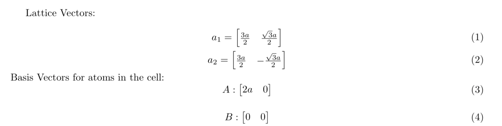
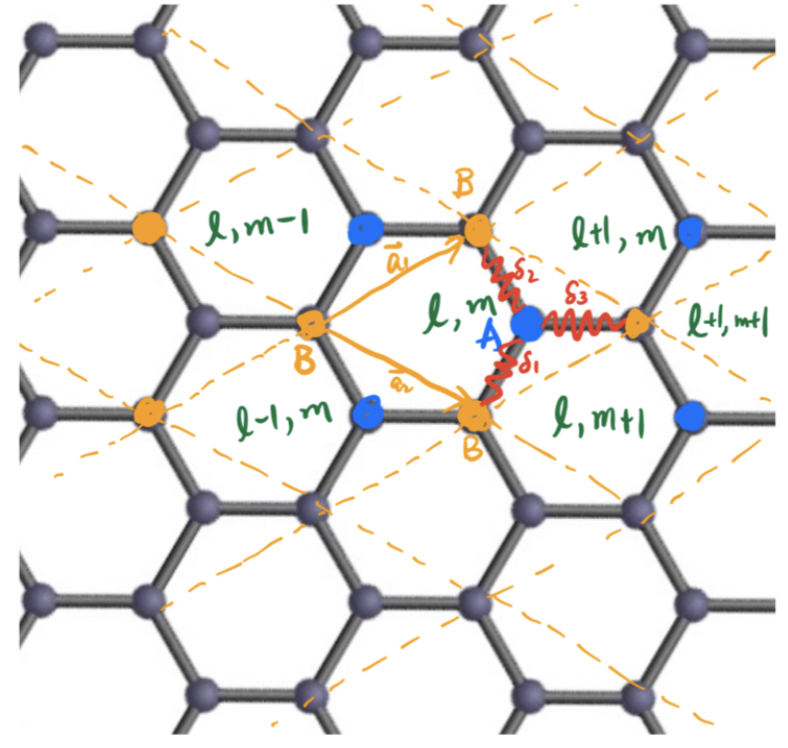
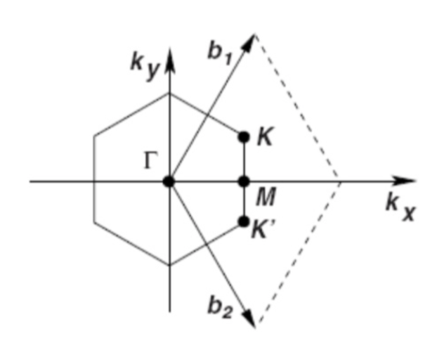
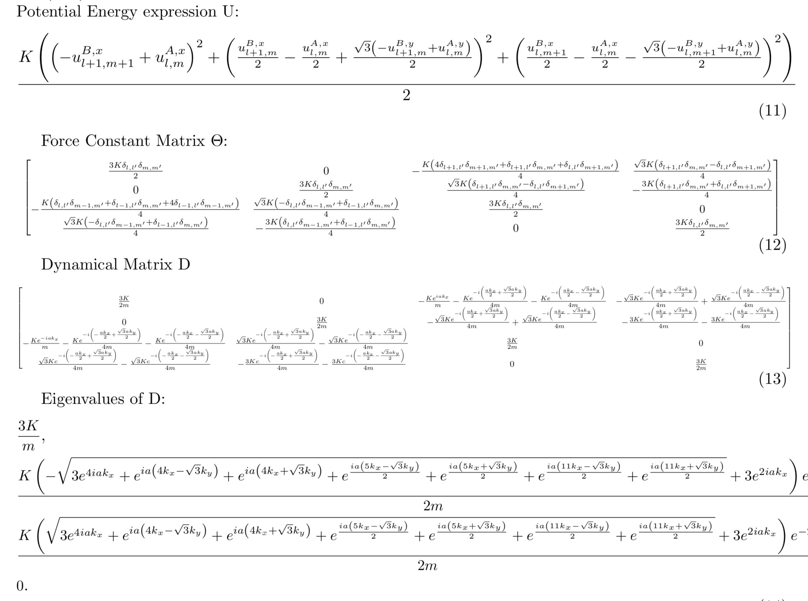
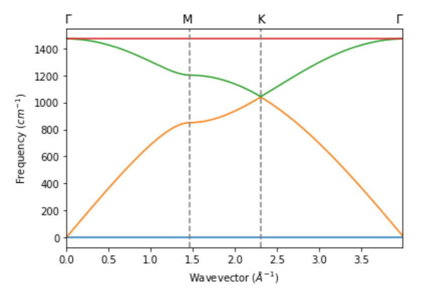
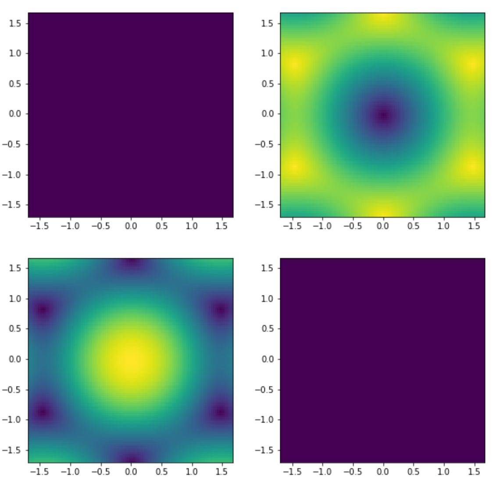
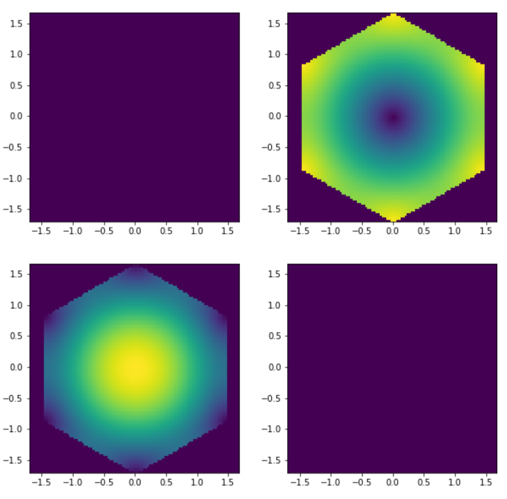
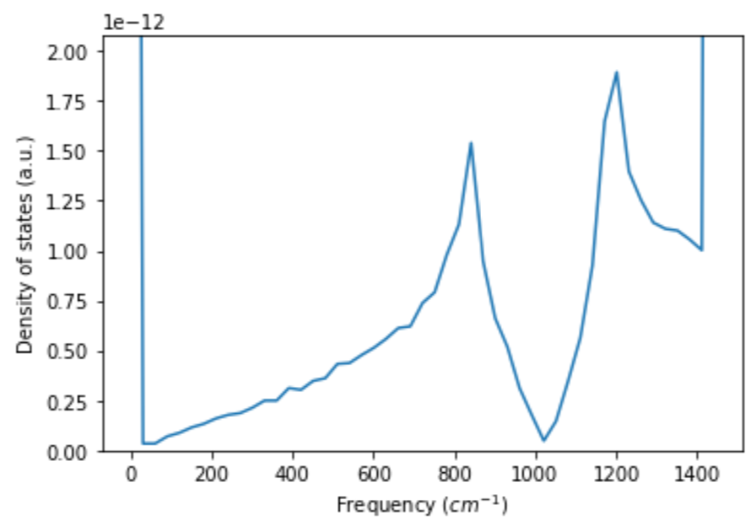
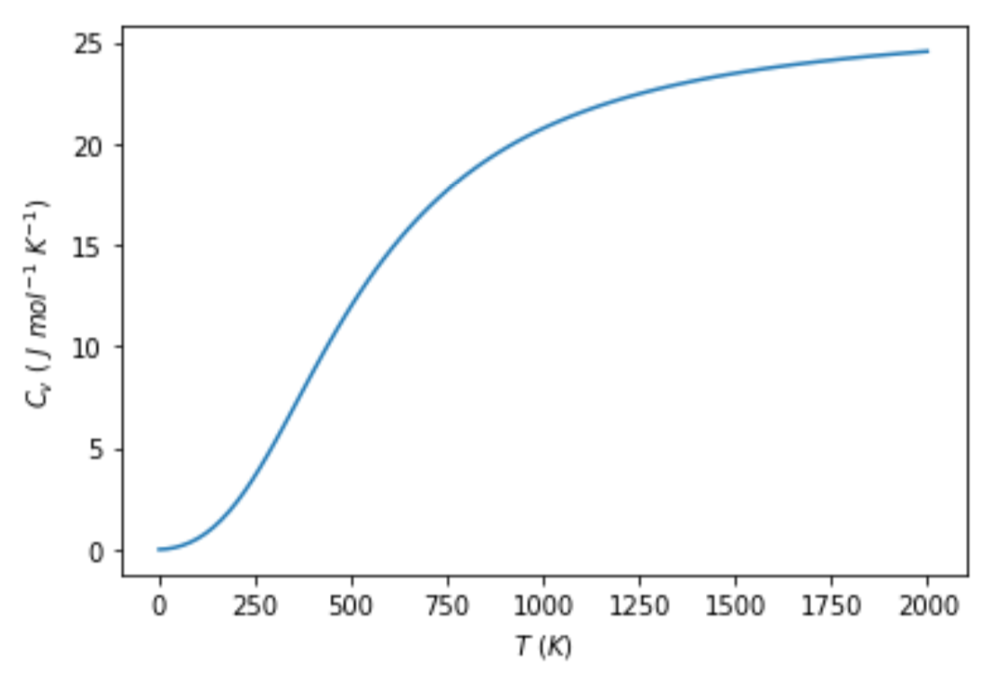

# Graphene Phonon Dispersion Band Structure with Central Force Model
The project only relies on the basic configurations of Lattice Vector and Basis Vectors of Atoms. Then by running the "grapheneCentralForceModel.ipynb" cell by cell, you will get everything as shown below. You can choose your own Lattice Vector and Basis Vectors of Atoms instead, which should yield the same graphs for graphene. For other materials, as long as it only has lattice basic vectors and two basic vectors, the program could handle that, but you may modify the k-space coordinates to get accurate dispersion.

## Basic Configurations (you can change and choose your own):

## Unit Cell, Atom Basis Vectors, and Reciprocal Lattice (you can change and choose your own):
.
.

## Potential Energy, Constant Force Matrix, Dynamical Matrix, and Eigenvalues:

## Phonon Dispersion Band Structure along Γ-M-K-Γ:
.

## Contours of Dispersion in k-space
.

## Cropped Contours of Dispersion in First Brillouin Zone of k-space
.

## Density of States (DOS) and Specific Heat Capacity (Cv)
.
.
